# Api Contracts

## Authenticator

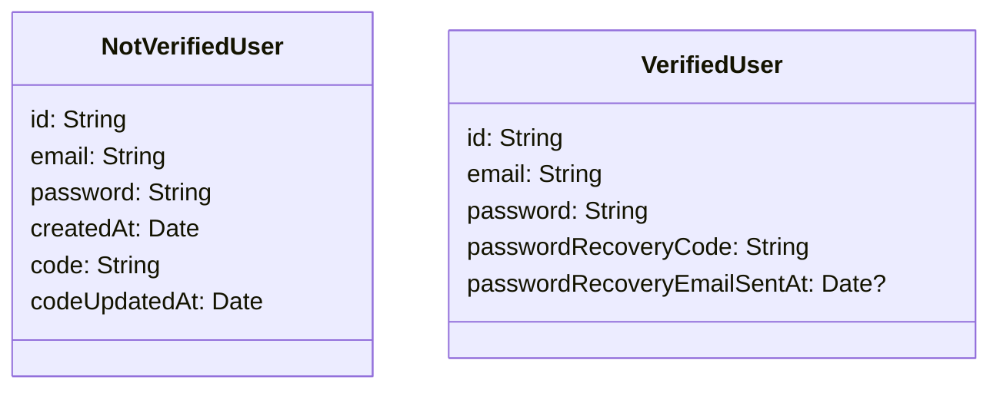

```mermaid
sequenceDiagram

    participant Client
    participant Authenticator

    Client->>Authenticator: Register POST /open/register
    Note over Client,Authenticator:Body: {<br>email: String <br> password: String<br>}
    Authenticator->>Authenticator:Validate body
    alt Body is Valid
        Authenticator->>Authenticator:Check if email is not taken
        alt Email is not taken
            Authenticator->>Authenticator:Register user
            Authenticator->>Client: 201 Created
        else Email is taken
            Authenticator->>Client: 409 Conflict
        end
    else Body is not Valid
        Authenticator->>Client: 400 Bad Request
    end

    Client->>Authenticator: Login POST /open/login
    Note over Client,Authenticator: Body: {<br>email: String <br> password: String<br>}
    Authenticator->>Authenticator:Authenticate
    alt Successfully authenticated
    Authenticator->>Authenticator:Create token
    Authenticator->>Client: 200 OK
    Note over Client,Authenticator: Body: token: String

    else User is not verified
        Authenticator->>Client: 403 Forbidden
    else Bad credentials
        Authenticator->>Client: 403 Forbidden
    end

    
    Client->>Authenticator: Verify user POST /open/verify
    Note over Client,Authenticator:Body: {<br>email: String <br> code: String<br>}
    Authenticator->>Authenticator: Check if not verified user exists
    alt User exists
        Authenticator->>Authenticator: Check code
        alt Code is correct
            Authenticator->>Authenticator: Verify user
            Authenticator->>Client: 200 OK
            Note over Client,Authenticator: Body: token: String
        else Code is not correct
            Authenticator->>Client: 400 Bad Request
        end
    else User does not exist
    Authenticator->>Client: 404 Not found
    end

    Client->>Authenticator: Send verification email POST /open/send-verification-email
    Note over Client,Authenticator:Body: {<br>email: String<br>}
    Authenticator->>Authenticator: Check if not verified user exists
    alt User exists
        Authenticator->>Authenticator: Check if email was recently sent
        alt Email wasn't recently sent
            Authenticator->>Authenticator: Generate code & send verification email
            Authenticator->>Client: 200 OK
        else Email was recently sent
            Authenticator->>Client: 429 Too many requests
        end
    else User does not exist
        Authenticator->>Client: 404 Not found
    end
  
  
  

    Client->>Authenticator: Send password-recovery email POST /open/recover-password
    Note over Client,Authenticator:Body: {<br>email: String<br>}
    Authenticator->>Authenticator: Check if verified user exists
    alt User exists
        Authenticator->>Authenticator: Check if email was recently sent
        alt Email wasn't recently sent
            Authenticator->>Authenticator: send password-recovery email
            Authenticator->>Client: 200 OK
        else Email was recently sent
            Authenticator->>Client: 429 Too many requests
        end
    else User does not exist
    Authenticator->>Client: 404 Not found
    end

    Client->>Authenticator: Send new password by email POST /open/send-password
    Note over Client,Authenticator:RequestParams: {<br>email: String<br>code: String<br>}
    Authenticator->>Authenticator: Check if not verified user exists
    alt User exists
        Authenticator->>Authenticator: Check code
        alt Code is correct
            Authenticator->>Authenticator: Generate & send new password by email
            Authenticator->>Client: 200 OK
        else Code is not correct
            Authenticator->>Client: 400 Bad Request
        end
    else User does not exist
        Authenticator->>Client: 404 Not found
    end

    Client->>Authenticator: Change password POST /external/change-password
    Note over Client,Authenticator:token-validated: TOKEN<br>Body: {<br>oldPassword: String<br>newPassword: String<br>}
    Authenticator->>Authenticator: Validate body
    alt Body is Valid
        Authenticator->>Authenticator: Check if user exists
        alt User exists
            Authenticator->>Authenticator: Check if old password is correct
            alt Password is correct
                Authenticator->>Authenticator: Update password
                Authenticator->>Client: 200 OK
            else Password is not correct
                Authenticator->>Client: 400 Bad Request
            end

        else User does not exist
            Authenticator->>Client: 404 Not found
        end
    else Body is not Valid
        Authenticator->>Client: 400 Bad Request
    end
```

## Email Sender

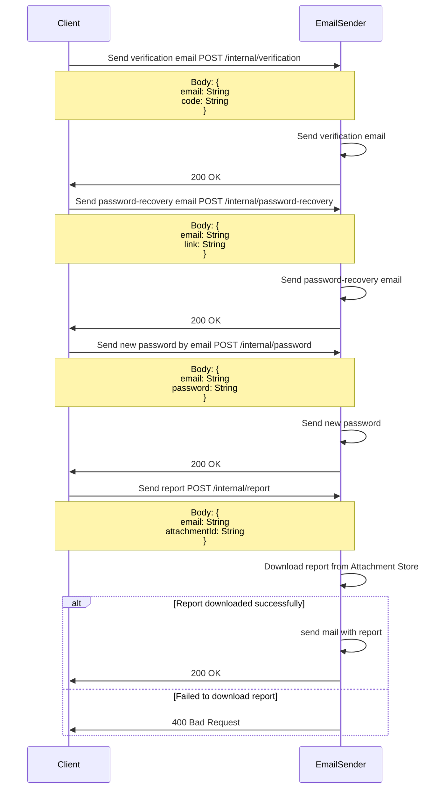

## User Details Manager

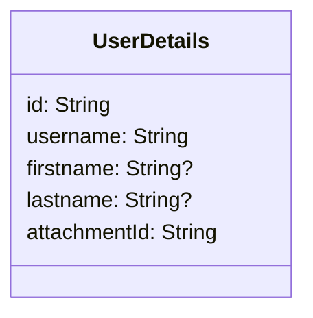

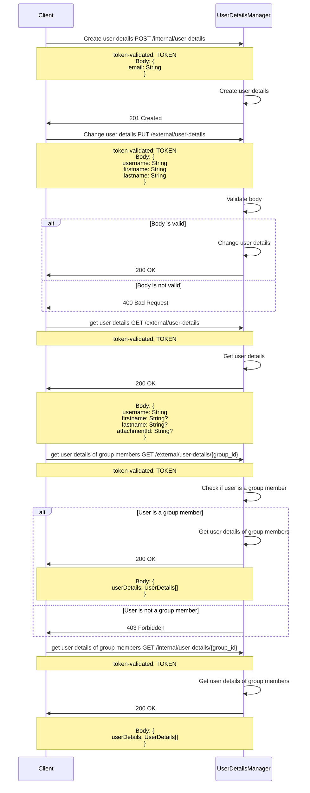

## Group Manager

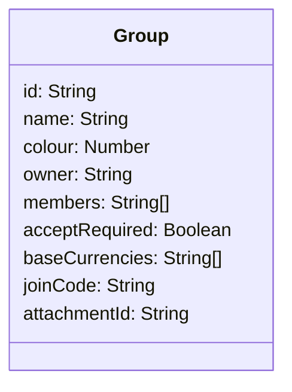

```mermaid
sequenceDiagram
    participant Client
    participant GroupManager
    
    Client->>GroupManager: Create group POST /external/groups
    Note over Client,GroupManager:token-validated: TOKEN<br> Body: {<br>name: String<br> colour: Number<br> acceptRequired: Boolean <br> baseCurrencies: String[] <br> attachmentId: String <br>}<br>
    GroupManager->>GroupManager:validate Body
    alt Body is valid
        GroupManager->>GroupManager: Check if currency is available
        alt Currency is available
            GroupManager->>GroupManager: Create group
            GroupManager->>Client: 201 Created
            Note over GroupManager,Client: Body: {<br>groupId: String,<br>}

        else Currency is not available
            GroupManager->>Client: 400 Bad Request
        end
    else Body is not valid
        GroupManager->>Client: 400 Bad Request
    end
    
    Client->>GroupManager: Delete group DELETE /external/groups/{group_id}
    Note over Client,GroupManager:token-validated: TOKEN
    GroupManager->>GroupManager: Check if user is owner of the group
    alt User is owner of the group
        GroupManager->>GroupManager:Check if group balance is equal to 0
        alt group balance == 0
            GroupManager->>GroupManager: Delete group
            GroupManager->>Client: 200 OK
        else group balance != 0
            GroupManager->>Client: 422 Unprocessable Content
        end
    else User is not owner of the group
        GroupManager->>Client: 403 Forbidden
    end

    Client->>GroupManager: Edit group PUT /external/groups/{group_id}
    Note over Client,GroupManager:token-validated: TOKEN<br> Body: {<br>name: String<br> colour: Number<br> }<br>

    GroupManager->>GroupManager: Check if user is owner of the group
    alt User is owner of the group
        GroupManager->>GroupManager: Edit group data
        GroupManager->>Client: 200 OK
    else User is not owner of the group
        GroupManager->>Client: 403 Forbidden
    end

    
    Client->>GroupManager: Get group data GET /external/groups/{group_id}
    Note over Client,GroupManager:token-validated: TOKEN
    GroupManager->>GroupManager: Check if user is a group member
    alt User is a group member
        GroupManager->>GroupManager: Get group data
        GroupManager->>Client: 200 OK
        Note over GroupManager,Client:Body: {<br>name: String<br> colour: Number<br> owner: String <br> members: String[] <br> acceptRequired: Boolean <br> baseCurrencies: String[] <br> joinCode:String <br> attachmentId: String<br>}<br>
    else User is not a group member
        GroupManager->>Client: 403 Forbidden
    end

    Client->>GroupManager: Get user's groups basic data GET /external/groups
    Note over Client,GroupManager:token-validated: TOKEN
    GroupManager->>GroupManager: Get user's groups basic data
    GroupManager->>Client: 200 OK
    Note over GroupManager,Client:Body: {<br> userGroupsBasicData: UserGroupsBasicData <br>}

    Client->>GroupManager: Get user's groups ids GET /internal/groups?user_id=val
    GroupManager->>GroupManager: Get user's groups id
    GroupManager->>Client: 200 OK
    Note over GroupManager,Client:Body: { <br> groupIds: GroupIds<br> }

    Client->>GroupManager: GET members ids GET /internal/members/{group_id}
    GroupManager->>GroupManager: Get members ids
    GroupManager->>Client: 200 OK
    Note over GroupManager,Client:Body: {<br> memberIds: MemberIds<br>}

    Client->>GroupManager: Get group data GET /internal/groups/{group_id}
    GroupManager->>GroupManager: Get group data
    GroupManager->>Client: 200 OK
    Note over GroupManager,Client:Body: {<br>members: String[]<br> acceptRequired: Boolean <br> baseCurrencies: String[]<br>}<br>
    
    Client->>GroupManager: Join group POST /external/join
    Note over Client,GroupManager:token-validated: TOKEN <br> Body: { <br> code: String <br> } <br>
    GroupManager->>GroupManager: Check if code is correct
    alt Code is correct
        GroupManager->>GroupManager: Add user to the group
        GroupManager->>Client: 200 OK
    else Code is not correctcurrencies
        GroupManager->>Client: 400 Bad Request
    end

```

## Expense Manager

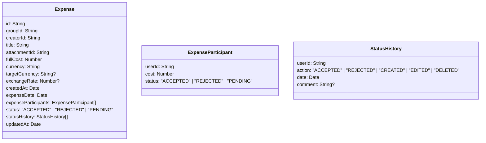

```mermaid
sequenceDiagram
    participant Client
    participant ExpenseManager
    
    Client->>ExpenseManager: Create Expense POST /external/expenses?group_id={group_id}
    Note over Client,ExpenseManager: token-validated: TOKEN<br> Body: { <br> title: String<br>attachmentId: String<br>fullCost: Number<br> currency: String<br> targetCurrency: String? <br> expenseDate: Date<br> membersWithCosts: MembersWithCosts <br>}
    ExpenseManager->>ExpenseManager:Validate body
    alt Body is Valid
        ExpenseManager->>ExpenseManager: Check if user is a group member
        alt User is a group member
            ExpenseManager->>ExpenseManager: Check if currency & targetCurrency are available & if targetCurrency is main
            alt Currencies are available
                ExpenseManager->>ExpenseManager: Check if all participants are group members
                alt All participants are group members
                    ExpenseManager->>ExpenseManager: Fetch exchange rate
                    ExpenseManager->>ExpenseManager: Create expense
                    ExpenseManager->>Client: 201 Created
                    Note over ExpenseManager,Client: Body{<br> expenseId: String <br>}
                else Not all participants are group members
                    ExpenseManager->>Client: 422 Unprocessable Content
                end
            else Currencies are not available
                ExpenseManager->>Client: 400 Bad Request
            end
        else User is not a group member
            ExpenseManager->>Client: 403 Forbidden
        end
    else Body is not valid
    ExpenseManager->>Client: 400 Bad Request
    end
    
    Client->>ExpenseManager: Edit expense PUT /external/expenses/{expense_id}?group_id={group_id}
    Note over Client,ExpenseManager: token-validated: TOKEN<br> Body: { <br> title: String<br>fullCost: Number<br> currency: String<br> targetCurrency: String?<br> expenseDate: Date<br> membersWithCosts: MembersWithCosts <br>}
    ExpenseManager->>ExpenseManager:Validate body
    alt Body is Valid
        ExpenseManager->>ExpenseManager: Check if user is an owner of the expense
        alt User is an owner of the expense
            ExpenseManager->>ExpenseManager: Check if currency & targetCurrency are available  & if targetCurrency is main
            alt Currencies are available
                ExpenseManager->>ExpenseManager: Check if all participants are group members
                alt All participants are group members
                    ExpenseManager->>ExpenseManager: Fetch exchange rate
                    ExpenseManager->>ExpenseManager: Edit expense & update statusHistory & set all statuses to pending
                    ExpenseManager->>Client: 200 OK
                else Not all participants are group members
                    ExpenseManager->>Client: 422 Unprocessable Content
                end
            else Currenceis are not available
                ExpenseManager->>Client: 400 Bad Request
            end
        else User is not an owner of the expense
            ExpenseManager->>Client: 403 Forbidden
        end
    else Body is not valid
        ExpenseManager->>Client: 400 Bad Request
    end
    
    Client->>ExpenseManager: Delete expense DELETE /external/expenses/{expense_id}?group_id={group_id}
    Note over Client,ExpenseManager: token-validated: TOKEN
    ExpenseManager->>ExpenseManager: Check if user is an owner of the expense
    alt User is an owner of the expense
        ExpenseManager->>ExpenseManager: Delete expense
        ExpenseManager->>Client: 200 OK
    else User is not an owner of the expense
        ExpenseManager->>Client: 403 Forbidden
    end
    
    Client->>ExpenseManager: Get expense GET /external/expenses/{expense_id}?group_id={group_id}
    Note over Client,ExpenseManager: token-validated: TOKEN
    ExpenseManager->>ExpenseManager: Check if user is a group member
    alt User is a group member
        ExpenseManager->>ExpenseManager: Get expense data
        ExpenseManager->>Client: 200 OK
        Note over Client,ExpenseManager:<br> Body: { <br> id: String<br> creatorId: String <br> title: String<br>attachmentId: String<br>fullCost: Number<br> currency: String<br> targetCurrency: String?<br>exchangeRate: String?<br> expenseDate: Date <br> createdAt: Date <br> expenseParticipants: ExpenseParticipant[] <br> status: "ACCEPTED" | "REJECTED" | "PENDING" <br> statusHistory: StatusHistory[] <br>updatedAt: Date<br>}
    else User is not a group member
        ExpenseManager->>Client: 403 Forbidden
    end

    Client->>ExpenseManager: Get expense GET /external/expenses?group_id={group_id}&filters=val
    Note over Client,ExpenseManager: token-validated: TOKEN
    ExpenseManager->>ExpenseManager: Check if user is a group member
    alt User is a group member
        ExpenseManager->>ExpenseManager: Get filtered expenses
        ExpenseManager->>Client: 200 OK
        Note over Client,ExpenseManager:<br> Body: { <br> expensesBasicData: ExpenseBasicData[] <br>}
    else User is not a group member
        ExpenseManager->>Client: 403 Forbidden
    end

    Client->>ExpenseManager: Accept or reject expense POST /external/decide?group_id={group_id}&expense_id={expense_id}
    Note over Client,ExpenseManager: token-validated: TOKEN <br> Body: { <br> decision: "ACCEPT" | "REJECT" <br>comment: String<br>}
    ExpenseManager->>ExpenseManager:Validate body
    alt Body is Valid
        ExpenseManager->>ExpenseManager: Check if user is an expense participant
        alt User is an expense participant
        ExpenseManager->>ExpenseManager: Set status for user & updateStatusHistory
            ExpenseManager->>Client: 200 OK
        else User is not an expense participant
            ExpenseManager->>Client: 403 Forbidden
        end
    else Body is not Valid    
        ExpenseManager->>Client: 400 Bad Request
    end
    
    
    Client->>ExpenseManager: Get group expenses GET /internal/expenses?group_id={group_id}
    Note over Client,ExpenseManager: token-validated: TOKEN
    ExpenseManager->>ExpenseManager: Get expenses data
    ExpenseManager->>Client: 200 OK
    Note over Client,ExpenseManager:<br> Body: { <br> expensesFinanceData: ExpenseFinanceData[] <br>}

```

## Payment Manager

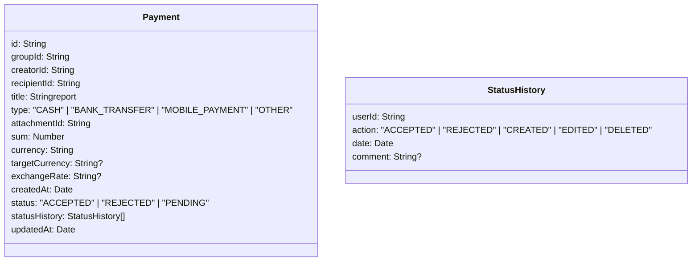

```mermaid
sequenceDiagram
    participant Client
    participant PaymentManager

    Client->>PaymentManager: Create Payment POST /external/payments?group_id={group_id}
    Note over Client,PaymentManager: token-validated: TOKEN<br> Body: { <br> recipientId:String <br> title: String<br> type: Type <br>attachmentId: String<br>sum: Number<br> currency: String<br> targetCurrency: String?<br>}
    PaymentManager->>PaymentManager:Validate body
    alt Body is Valid
        PaymentManager->>PaymentManager: Check if user is a group member
        alt User is a group member
            PaymentManager->>PaymentManager: Check if currency & targetCurrency are available  & if targetCurrency is main
            alt Currencies are available
                PaymentManager->>PaymentManager: Check if recipient is a group member
                alt Recipient is a group member
                    PaymentManager->>PaymentManager: Fetch exchange rate
                    PaymentManager->>PaymentManager: Create payment
                    PaymentManager->>Client: 201 Created
                    Note over PaymentManager,Client: Body{<br> paymentId: String <br>}
                else Recipient is not a group member
                    PaymentManager->>Client: 422 Unprocessable Content
                end
            else Currencies are not available
                PaymentManager->>Client: 400 Bad Request
            end
        else User is not a group member
            PaymentManager->>Client: 403 Forbidden
        end
    else Body is not valid
        PaymentManager->>Client: 400 Bad Request
    end


    Client->>PaymentManager: Edit Payment PUT /external/payments/{payment_id}?group_id={group_id}
    Note over Client,PaymentManager: token-validated: TOKEN<br> Body: { <br> recipientId:String <br> title: String<br> type: Type<br>sum: Number<br> currency: String<br> targetCurrency: String?<br>}
    PaymentManager->>PaymentManager:Validate body
    alt Body is Valid
        PaymentManager->>PaymentManager: Check if user is a payment owner
        alt Check if user is a payment owner
            PaymentManager->>PaymentManager: Check if currency & targetCurrency are available  & if targetCurrency is main
            alt Currencies are available
                PaymentManager->>PaymentManager: Check if recipient is a group member
                alt Recipient is a group member
                    PaymentManager->>PaymentManager: Fetch exchange rate
                    PaymentManager->>PaymentManager: Edit payment & update statusHistory & set all statuses to pending
                    PaymentManager->>Client: 201 Created
                    Note over PaymentManager,Client: Body{<br> paymentId: String <br>}
                else Recipient is not a group member
                    PaymentManager->>Client: 422 Unprocessable Content
                end
            else Currencies are not available
                PaymentManager->>Client: 400 Bad Request
            end
        else Check if user is not a payment owner
            PaymentManager->>Client: 403 Forbidden
        end
    else Body is not valid
        PaymentManager->>Client: 400 Bad Request
    end


    Client->>PaymentManager: Delete payment DELETE /external/payments/{payment_id}?group_id={group_id}
    Note over Client,PaymentManager: token-validated: TOKEN
    PaymentManager->>PaymentManager: Check if user is an owner of the payment
    alt User is an owner of the payment
        PaymentManager->>PaymentManager: Delete payment
        PaymentManager->>Client: 200 OK
    else User is not an owner of the payment
        PaymentManager->>Client: 403 Forbidden
    end


    Client->>PaymentManager: Get payment GET /external/payments/{payment_id}?group_id={group_id}
    Note over Client,PaymentManager: token-validated: TOKEN
    PaymentManager->>PaymentManager: Check if user is a group member
    alt User is a group member
        PaymentManager->>PaymentManager: Get payment data
        PaymentManager->>Client: 200 OK
        Note over Client,PaymentManager:Body: {<br> id: String <br>creatorId: String<br> recipientId: String <br> title: String<br> type: Type<br>attachmentId:String<br> sum: Number<br> currency: String<br> targetCurrency: String?<br>exchangeRate:Number?<br>createdAt:Date<br>status: "ACCEPTED" | "REJECTED" | "PENDING"<br>statusHistory: StatusHistory[]<br>updatedAt: Date<br>}
    else User is not a group member
        PaymentManager->>Client: 403 Forbidden
    end


    Client->>PaymentManager: Get payments GET /external/payments?group_id={group_id}&filters=val
    Note over Client,PaymentManager: token-validated: TOKEN
    PaymentManager->>PaymentManager: Check if user is a group member
    alt User is a group member
        PaymentManager->>PaymentManager: Get filtered payments
        PaymentManager->>Client: 200 OK
        Note over Client,PaymentManager:<br> Body: { <br> paymentsBasicData: PaymentBasicData[] <br>}
    else User is not a group member
        PaymentManager->>Client: 403 Forbidden
    end

    Client->>PaymentManager: Accept or reject payment POST /external/decide/?group_id={group_id}&payment_id={payment_id}
    Note over Client,PaymentManager: token-validated: TOKEN <br> Body: { <br> decision: "ACCEPT" | "REJECT" <br> comment: String? <br>}
    PaymentManager->>PaymentManager:Validate body
    alt Body is Valid
        PaymentManager->>PaymentManager: Check if user is a payment participant
        alt User is a payment participant
            PaymentManager->>PaymentManager: Set status for user & update StatusHistory
            PaymentManager->>Client: 200 OK
        else User is not an payment participant
            PaymentManager->>Client: 403 Forbidden
        end
    else Body is not Valid
        PaymentManager->>Client: 400 Bad Request
    end

    Client->>PaymentManager: Get group payments GET /internal/payments?group_id={group_id}
    Note over Client,PaymentManager: token-validated: TOKEN
    PaymentManager->>PaymentManager: Get payments data
    PaymentManager->>Client: 200 OK
    Note over Client,PaymentManager:<br> Body: { <br> paymentsFinanceData: PaymentsFinanceData[] <br>}

```

## Finance Adapter

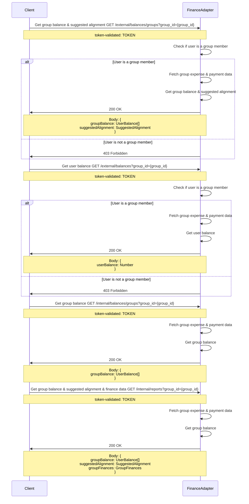

## Report Creator

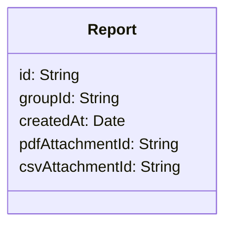

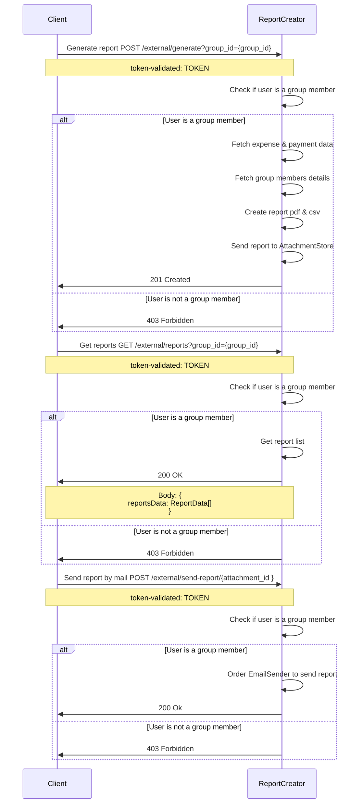

## Currency Manager

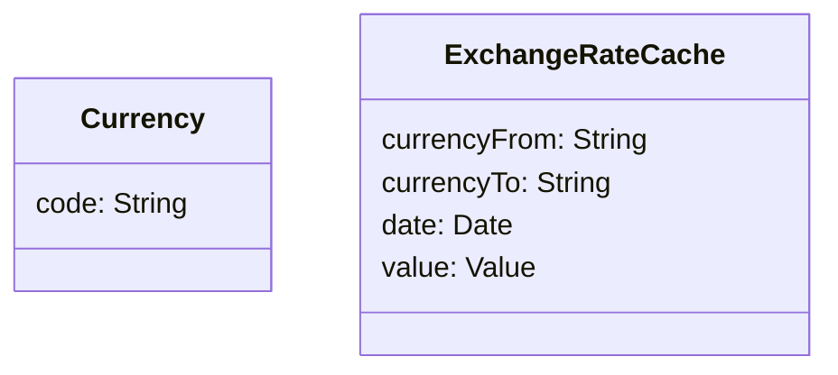

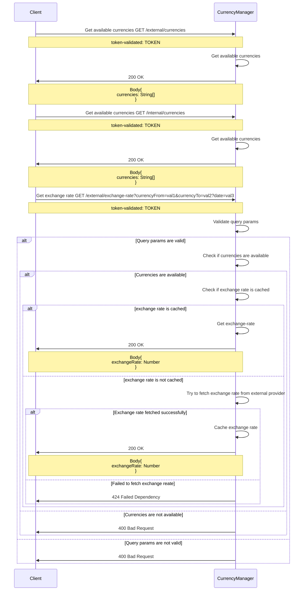

## Attachment Store

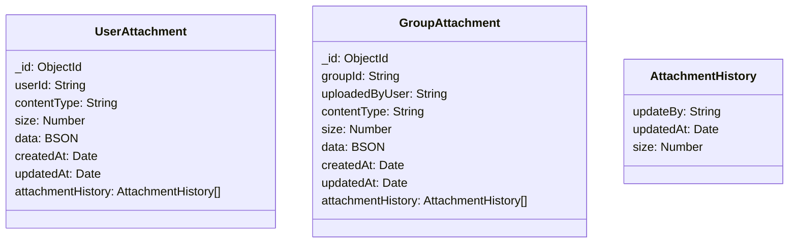

```mermaid

sequenceDiagram
    
    participant Client
    participant AttachmentStore

    Client->>AttachmentStore: Upload Attachment POST /external/attachments
    Note over Client,AttachmentStore: token-validated: TOKEN<br>Body: ByteArray
    activate AttachmentStore
    AttachmentStore->>AttachmentStore: Check media type
    alt Media type is allowed
        AttachmentStore->>AttachmentStore: Check attachment size
        alt Attachment size within limit
            AttachmentStore->>AttachmentStore: Save attachment
            AttachmentStore->>Client: 201 Created
            deactivate AttachmentStore
            Note over Client,AttachmentStore: content-type: MEDIA_TYPE<br>Body: {<br>attachmentId: "AttachmentId",<br>}
        else Attachment size exceeds limit
            AttachmentStore->>Client: 413 Payload Too Large
        end
    else Media type is not allowed
        AttachmentStore->>Client: 415 Unsupported Media Type
    end

    Client->>AttachmentStore: Upload Attachment POST external/attachments/groups/{groupId}
    Note over Client,AttachmentStore: token-validated:TOKEN<br>Body:ByteArray
    activate AttachmentStore
    AttachmentStore->>AttachmentStore: Check access to group for that user
    alt User has access to group
        AttachmentStore->>AttachmentStore: Check media type
        alt Media type is allowed
            AttachmentStore->>AttachmentStore: Check attachment size
            alt Attachment size within limit
                AttachmentStore->>AttachmentStore: Save attachment
                AttachmentStore->>Client: 201 Created
                deactivate AttachmentStore
                Note over Client,AttachmentStore: content-type:MEDIA_TYPE<br>Body: {<br>attachmentId:"AttachmentId",<br>}
            else Attachment size exceeds limit
                AttachmentStore->>Client: 413 Payload Too Large
            end
        else Media type is not allowed
            AttachmentStore->>Client: 415 Unsupported Media Type
        end
    else User does not have access to group
        AttachmentStore->>Client: 403 Forbidden
    end

    Client->>AttachmentStore: Get Attachment GET /external/attachments/{attachmentId}
    Note over Client,AttachmentStore: token-validated: TOKEN
    activate AttachmentStore
    AttachmentStore->>AttachmentStore: Check user access to attachment
    alt User has access to attachment
        AttachmentStore->>AttachmentStore: Check attachment exists
        alt Attachment is found
            AttachmentStore->>AttachmentStore: Get attachment
            AttachmentStore->>Client: 200 OK
            deactivate AttachmentStore
            Note over Client,AttachmentStore: content-type: MEDIA_TYPE<br>Body: ByteArray
        else Attachment is not found
            AttachmentStore->>Client: 404 Not Found
        end
    else User does not have access to attachment
        AttachmentStore->>Client: 403 Forbidden
    end

    Client->>AttachmentStore: Get Attachment GET /external/attachments/groups/{groupId}/{attachmentId}
    Note over Client,AttachmentStore: token-validated: TOKEN
    activate AttachmentStore
    AttachmentStore->>AttachmentStore: Check user access to attachment
    alt User has access to attachment
        AttachmentStore->>AttachmentStore: Check attachment exists
        alt Attachment is found
            AttachmentStore->>AttachmentStore: Get attachment
            AttachmentStore->>Client: 200 OK
            deactivate AttachmentStore
            Note over Client,AttachmentStore: content-type: MEDIA_TYPE<br>Body: ByteArray
        else Attachment is not found
            AttachmentStore->>Client: 404 Not Found
        end
    else User does not have access to attachment
        AttachmentStore->>Client: 403 Forbidden
    end

    Client->>AttachmentStore: Update Attachment PUT /external/attachments/{attachmentId}
    Note over Client,AttachmentStore: token-validated: TOKEN<br>Body: Updated Attachment Data
    activate AttachmentStore
    AttachmentStore->>AttachmentStore: Check if user has access to attachment
    alt User has access to attachment
        AttachmentStore->>AttachmentStore: Check if attachment exists
        alt Attachment exists
            AttachmentStore->>AttachmentStore: Check if updated media type is the same
            alt Media type is the same
                AttachmentStore->>AttachmentStore: Update attachment data
                AttachmentStore->>Client: 200 OK
                Note over Client,AttachmentStore: content-type:MEDIA_TYPE<br>Body: {<br>attachmentId:"AttachmentId",<br>}
                deactivate AttachmentStore
            else Media type is not the same
                AttachmentStore->>Client: 415 Unsupported Media Type
            end
        else Attachment does not exist
            AttachmentStore->>Client: 404 Not Found
        end
    else User does not have access to attachment
        AttachmentStore->>Client: 403 Forbidden
    end

    Client->>AttachmentStore: Update Attachment PUT /external/attachments/groups/{groupId}/{attachmentId}
    Note over Client,AttachmentStore: token-validated: TOKEN<br>Body: Updated Attachment Data
    activate AttachmentStore
    AttachmentStore->>AttachmentStore: Check if user has access to attachment in the group
    alt User has access to attachment in the group
        AttachmentStore->>AttachmentStore: Check if attachment exists in the group
        alt Attachment exists in the group
            AttachmentStore->>AttachmentStore: Check if updated media type is the same
            alt Media type is the same
                AttachmentStore->>AttachmentStore: Update attachment data
                AttachmentStore->>Client: 200 OK
                Note over Client,AttachmentStore: content-type:MEDIA_TYPE<br>Body: {<br>attachmentId:"AttachmentId",<br>}
                deactivate AttachmentStore
            else Media type is not the same
                AttachmentStore->>Client: 415 Unsupported Media Type
            end
        else Attachment does not exist in the group
            AttachmentStore->>Client: 404 Not Found
        end
    else User does not have access to attachment in the group
        AttachmentStore->>Client: 403 Forbidden
    end
    
```