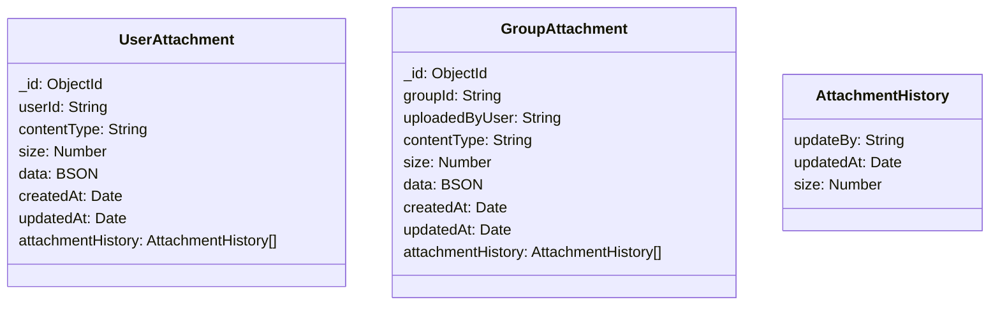

# Api Contracts

## Attachment-Store

```mermaid

classDiagram
    class UserAttachment {
    _id: ObjectId
    userId: String
    contentType: String
    size: Number
    data: BSON
    createdAt: Date
    updatedAt: Date
    attachmentHistory: AttachmentHistory[]
    }
  
    class GroupAttachment {
        _id: ObjectId
        groupId: String
        uploadedByUser: String
        contentType: String
        size: Number
        data: BSON
        createdAt: Date
        updatedAt: Date
        attachmentHistory: AttachmentHistory[]
    }
    
    class AttachmentHistory {
        updateBy: String
        updatedAt: Date
        size: Number
    }
```

```mermaid
sequenceDiagram
    
    participant Client
    participant AttachmentStore

    Client->>AttachmentStore: Upload Attachment POST /external/attachments
    Note over Client,AttachmentStore: token-validated: TOKEN<br>Body: ByteArray
    activate AttachmentStore
    AttachmentStore->>AttachmentStore: Check media type
    alt Media type is allowed
        AttachmentStore->>AttachmentStore: Check attachment size
        alt Attachment size within limit
            AttachmentStore->>AttachmentStore: Save attachment
            AttachmentStore->>Client: 201 Created
            deactivate AttachmentStore
            Note over Client,AttachmentStore: content-type: MEDIA_TYPE<br>Body: {<br>attachmentId: "AttachmentId",<br>}
        else Attachment size exceeds limit
            AttachmentStore->>Client: 413 Payload Too Large
        end
    else Media type is not allowed
        AttachmentStore->>Client: 415 Unsupported Media Type
    end

    Client->>AttachmentStore: Upload Attachment POST external/attachments/groups/{groupId}
    Note over Client,AttachmentStore: token-validated:TOKEN<br>Body:ByteArray
    activate AttachmentStore
    AttachmentStore->>AttachmentStore: Check access to group for that user
    alt User has access to group
        AttachmentStore->>AttachmentStore: Check media type
        alt Media type is allowed
            AttachmentStore->>AttachmentStore: Check attachment size
            alt Attachment size within limit
                AttachmentStore->>AttachmentStore: Save attachment
                AttachmentStore->>Client: 201 Created
                deactivate AttachmentStore
                Note over Client,AttachmentStore: content-type:MEDIA_TYPE<br>Body: {<br>attachmentId:"AttachmentId",<br>}
            else Attachment size exceeds limit
                AttachmentStore->>Client: 413 Payload Too Large
            end
        else Media type is not allowed
            AttachmentStore->>Client: 415 Unsupported Media Type
        end
    else User does not have access to group
        AttachmentStore->>Client: 403 Forbidden
    end

    Client->>AttachmentStore: Get Attachment GET /external/attachments/{attachmentId}
    Note over Client,AttachmentStore: token-validated: TOKEN
    activate AttachmentStore
    AttachmentStore->>AttachmentStore: Check user access to attachment
    alt User has access to attachment
        AttachmentStore->>AttachmentStore: Check attachment exists
        alt Attachment is found
            AttachmentStore->>AttachmentStore: Get attachment
            AttachmentStore->>Client: 200 OK
            deactivate AttachmentStore
            Note over Client,AttachmentStore: content-type: MEDIA_TYPE<br>Body: ByteArray
        else Attachment is not found
            AttachmentStore->>Client: 404 Not Found
        end
    else User does not have access to attachment
        AttachmentStore->>Client: 403 Forbidden
    end

    Client->>AttachmentStore: Get Attachment GET /external/attachments/groups/{groupId}/{attachmentId}
    Note over Client,AttachmentStore: token-validated: TOKEN
    activate AttachmentStore
    AttachmentStore->>AttachmentStore: Check user access to attachment
    alt User has access to attachment
        AttachmentStore->>AttachmentStore: Check attachment exists
        alt Attachment is found
            AttachmentStore->>AttachmentStore: Get attachment
            AttachmentStore->>Client: 200 OK
            deactivate AttachmentStore
            Note over Client,AttachmentStore: content-type: MEDIA_TYPE<br>Body: ByteArray
        else Attachment is not found
            AttachmentStore->>Client: 404 Not Found
        end
    else User does not have access to attachment
        AttachmentStore->>Client: 403 Forbidden
    end

    Client->>AttachmentStore: Update Attachment PUT /external/attachments/{attachmentId}
    Note over Client,AttachmentStore: token-validated: TOKEN<br>Body: Updated Attachment Data
    activate AttachmentStore
    AttachmentStore->>AttachmentStore: Check if user has access to attachment
    alt User has access to attachment
        AttachmentStore->>AttachmentStore: Check if attachment exists
        alt Attachment exists
            AttachmentStore->>AttachmentStore: Check if updated media type is the same
            alt Media type is the same
                AttachmentStore->>AttachmentStore: Update attachment data
                AttachmentStore->>Client: 200 OK
                Note over Client,AttachmentStore: content-type:MEDIA_TYPE<br>Body: {<br>attachmentId:"AttachmentId",<br>}
                deactivate AttachmentStore
            else Media type is not the same
                AttachmentStore->>Client: 415 Unsupported Media Type
            end
        else Attachment does not exist
            AttachmentStore->>Client: 404 Not Found
        end
    else User does not have access to attachment
        AttachmentStore->>Client: 403 Forbidden
    end

    Client->>AttachmentStore: Update Attachment PUT /external/attachments/groups/{groupId}/{attachmentId}
    Note over Client,AttachmentStore: token-validated: TOKEN<br>Body: Updated Attachment Data
    activate AttachmentStore
    AttachmentStore->>AttachmentStore: Check if user has access to attachment in the group
    alt User has access to attachment in the group
        AttachmentStore->>AttachmentStore: Check if attachment exists in the group
        alt Attachment exists in the group
            AttachmentStore->>AttachmentStore: Check if updated media type is the same
            alt Media type is the same
                AttachmentStore->>AttachmentStore: Update attachment data
                AttachmentStore->>Client: 200 OK
                Note over Client,AttachmentStore: content-type:MEDIA_TYPE<br>Body: {<br>attachmentId:"AttachmentId",<br>}
                deactivate AttachmentStore
            else Media type is not the same
                AttachmentStore->>Client: 415 Unsupported Media Type
            end
        else Attachment does not exist in the group
            AttachmentStore->>Client: 404 Not Found
        end
    else User does not have access to attachment in the group
        AttachmentStore->>Client: 403 Forbidden
    end
    
```