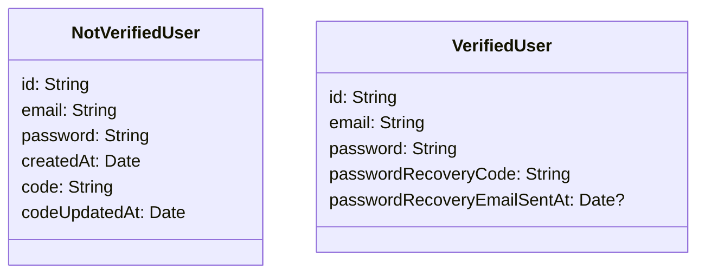
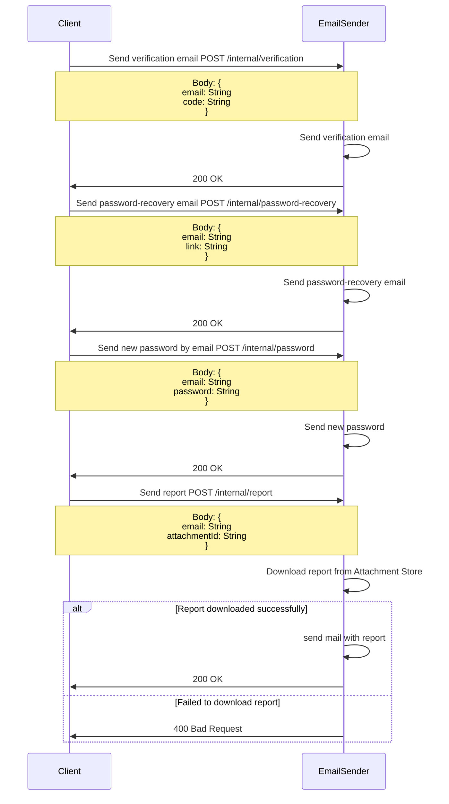
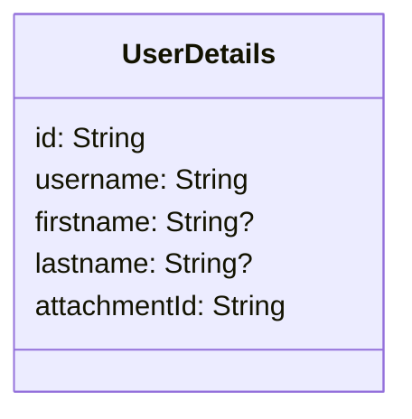
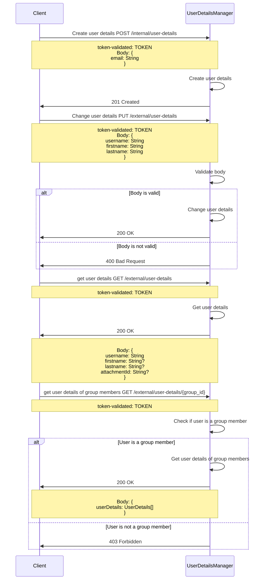
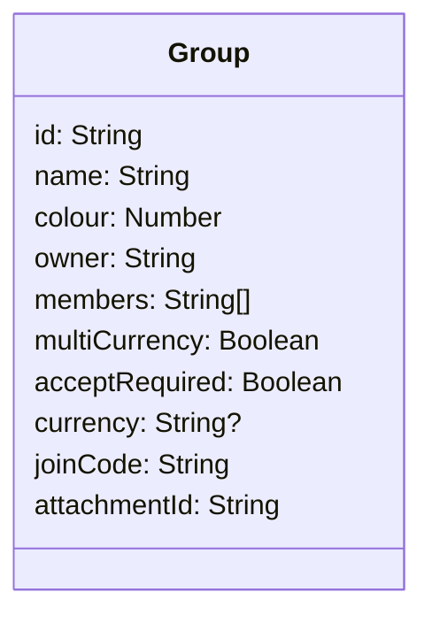
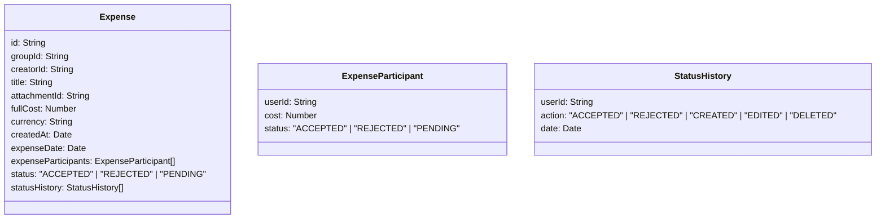
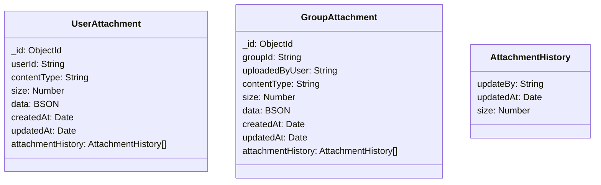

# Api Contracts

## Authenticator

```mermaid
classDiagram
class NotVerifiedUser {
    id: String
    email: String
    password: String
    createdAt: Date
    code: String
    codeUpdatedAt: Date
}

class VerifiedUser {
    id: String
    email: String
    password: String
    passwordRecoveryCode: String
    passwordRecoveryEmailSentAt: Date?
}

```

```mermaid
sequenceDiagram

    participant Client
    participant Authenticator

    Client->>Authenticator: Register POST /open/register
    Note over Client,Authenticator:Body: {<br>email: String <br> password: String<br>}
    Authenticator->>Authenticator:Validate body
    alt Body is Valid
        Authenticator->>Authenticator:Check if email is not taken
        alt Email is not taken
            Authenticator->>Authenticator:Register user
            Authenticator->>Client: 201 Created
        else Email is taken
            Authenticator->>Client: 409 Conflict
        end
    else Body is not Valid
        Authenticator->>Client: 400 Bad Request
    end

    Client->>Authenticator: Login POST /open/login
    Note over Client,Authenticator: Body: {<br>email: String <br> password: String<br>}
    Authenticator->>Authenticator:Authenticate
    alt Successfully authenticated
    Authenticator->>Authenticator:Create token
    Authenticator->>Client: 200 OK
    Note over Client,Authenticator: Body: token: String

    else User is not verified
        Authenticator->>Client: 403 Forbidden
    else Bad credentials
        Authenticator->>Client: 403 Forbidden
    end

    
    Client->>Authenticator: Verify user POST /open/verify
    Note over Client,Authenticator:Body: {<br>email: String <br> code: String<br>}
    Authenticator->>Authenticator: Check if not verified user exists
    alt User exists
        Authenticator->>Authenticator: Check code
        alt Code is correct
            Authenticator->>Authenticator: Verify user
            Authenticator->>Client: 200 OK
            Note over Client,Authenticator: Body: token: String
        else Code is not correct
            Authenticator->>Client: 400 Bad Request
        end
    else User does not exist
    Authenticator->>Client: 404 Not found
    end

    Client->>Authenticator: Send verification email POST /open/send-verification-email
    Note over Client,Authenticator:Body: {<br>email: String<br>}
    Authenticator->>Authenticator: Check if not verified user exists
    alt User exists
        Authenticator->>Authenticator: Check if email was recently sent
        alt Email wasn't recently sent
            Authenticator->>Authenticator: Generate code & send verification email
            Authenticator->>Client: 200 OK
        else Email was recently sent
            Authenticator->>Client: 429 Too many requests
        end
    else User does not exist
        Authenticator->>Client: 404 Not found
    end
  
  
  

    Client->>Authenticator: Send password-recovery email POST /open/recover-password
    Note over Client,Authenticator:Body: {<br>email: String<br>}
    Authenticator->>Authenticator: Check if verified user exists
    alt User exists
        Authenticator->>Authenticator: Check if email was recently sent
        alt Email wasn't recently sent
            Authenticator->>Authenticator: send password-recovery email
            Authenticator->>Client: 200 OK
        else Email was recently sent
            Authenticator->>Client: 429 Too many requests
        end
    else User does not exist
    Authenticator->>Client: 404 Not found
    end

    Client->>Authenticator: Send new password by email POST /open/send-password
    Note over Client,Authenticator:RequestParams: {<br>email: String<br>code: String<br>}
    Authenticator->>Authenticator: Check if not verified user exists
    alt User exists
        Authenticator->>Authenticator: Check code
        alt Code is correct
            Authenticator->>Authenticator: Generate & send new password by email
            Authenticator->>Client: 200 OK
        else Code is not correct
            Authenticator->>Client: 400 Bad Request
        end
    else User does not exist
        Authenticator->>Client: 404 Not found
    end

    Client->>Authenticator: Change password POST /external/change-password
    Note over Client,Authenticator:token-validated: TOKEN<br>Body: {<br>oldPassword: String<br>newPassword: String<br>}
    Authenticator->>Authenticator: Validate body
    alt Body is Valid
        Authenticator->>Authenticator: Check if user exists
        alt User exists
            Authenticator->>Authenticator: Check if old password is correct
            alt Password is correct
                Authenticator->>Authenticator: Update password
                Authenticator->>Client: 200 OK
            else Password is not correct
                Authenticator->>Client: 400 Bad Request
            end

        else User does not exist
            Authenticator->>Client: 404 Not found
        end
    else Body is not Valid
        Authenticator->>Client: 400 Bad Request
    end
```

## Email Sender

```mermaid
sequenceDiagram

    participant Client
    participant EmailSender

    Client->>EmailSender: Send verification email POST /internal/verification
    Note over Client,EmailSender:Body: {<br>email: String <br> code: String<br>}
    EmailSender->>EmailSender:Send verification email
    EmailSender->>Client: 200 OK

    Client->>EmailSender: Send password-recovery email POST /internal/password-recovery
    Note over Client,EmailSender:Body: {<br>email: String <br> link: String<br>}
    EmailSender->>EmailSender:Send password-recovery email
    EmailSender->>Client: 200 OK


    Client->>EmailSender: Send new password by email POST /internal/password
    Note over Client,EmailSender:Body: {<br>email: String <br> password: String<br>}
    EmailSender->>EmailSender:Send new password
    EmailSender->>Client: 200 OK
    
    Client->>EmailSender: Send report POST /internal/report
    Note over Client,EmailSender:Body: {<br>email: String <br> attachmentId: String<br>}
    EmailSender->>EmailSender: Download report from Attachment Store
    alt Report downloaded successfully
        EmailSender->>EmailSender:  send mail with report
        EmailSender->>Client: 200 OK
    else Failed to download report
        EmailSender->>Client: 400 Bad Request
    end
    
```

## User Details Manager

```mermaid
classDiagram

class UserDetails {
    id: String
    username: String
    firstname: String?
    lastname: String?
    attachmentId: String
}

```

```mermaid
sequenceDiagram

    participant Client
    participant UserDetailsManager

    Client->>UserDetailsManager: Create user details POST /internal/user-details
    Note over Client,UserDetailsManager: token-validated: TOKEN<br>Body: {<br>email: String <br>}
    UserDetailsManager->>UserDetailsManager: Create user details
    UserDetailsManager->>Client: 201 Created

    Client->>UserDetailsManager: Change user details PUT /external/user-details
    Note over Client,UserDetailsManager: token-validated: TOKEN<br> Body: {<br>username: String <br>firstname: String <br>lastname: String <br>}
    UserDetailsManager->>UserDetailsManager: Validate body
    alt Body is valid
        UserDetailsManager->>UserDetailsManager: Change user details
        UserDetailsManager->>Client: 200 OK
    else Body is not valid
        UserDetailsManager->>Client: 400 Bad Request
    end


    Client->>UserDetailsManager: get user details GET /external/user-details
    Note over Client,UserDetailsManager: token-validated: TOKEN
    UserDetailsManager->>UserDetailsManager: Get user details
    UserDetailsManager->>Client: 200 OK
    Note over Client,UserDetailsManager:<br> Body: {<br>username: String <br>firstname: String? <br>lastname: String? <br>attachmentId: String?<br>}

    Client->>UserDetailsManager: get user details of group members GET /external/user-details/{group_id}
    Note over Client,UserDetailsManager: token-validated: TOKEN
    UserDetailsManager->>UserDetailsManager: Check if user is a group member
    alt User is a group member
        UserDetailsManager->>UserDetailsManager: Get user details of group members
        UserDetailsManager->>Client: 200 OK
        Note over Client,UserDetailsManager:<br> Body: {<br> userDetails: UserDetails[] <br>}
    else User is not a group member
        UserDetailsManager->>Client: 403 Forbidden
    end
   
```

## Group Manager

```mermaid
classDiagram
    class Group {
        id: String
        name: String
        colour: Number
        owner: String
        members: String[]
        multiCurrency: Boolean
        acceptRequired: Boolean
        currency: String?
        joinCode: String
        attachmentId: String
        
    }
```

```mermaid
sequenceDiagram
    participant Client
    participant GroupManager
    
    Client->>GroupManager: Create group POST /external/groups
    Note over Client,GroupManager:token-validated: TOKEN<br> Body: {<br>name: String<br> colour: Number<br>multiCurrency: Boolean <br> acceptRequired: Boolean <br> currency: String? <br> attachmentId: String <br>}<br>
    GroupManager->>GroupManager:validate Body
    alt Body is valid
        GroupManager->>GroupManager: Check if currency is available
        alt Currency is available
            GroupManager->>GroupManager: Create group
            GroupManager->>Client: 201 Created
            Note over GroupManager,Client: Body: {<br>groupId: String,<br>}

        else Currency is not available
            GroupManager->>Client: 400 Bad Request
        end
    else Body is not valid
        GroupManager->>Client: 400 Bad Request
    end
    
    Client->>GroupManager: Delete group DELETE /external/groups/{group_id}
    Note over Client,GroupManager:token-validated: TOKEN
    GroupManager->>GroupManager: Check if user is owner of the group
    alt User is owner of the group
        GroupManager->>GroupManager:Check if group balance is equal to 0
        alt group balance == 0
            GroupManager->>GroupManager: Delete group
            GroupManager->>Client: 200 OK
        else group balance != 0
            GroupManager->>Client: 422 Unprocessable Content
        end
    else User is not owner of the group
        GroupManager->>Client: 403 Forbidden
    end

    Client->>GroupManager: Edit group PUT /external/groups/{group_id}
    Note over Client,GroupManager:token-validated: TOKEN<br> Body: {<br>name: String<br> colour: Number<br> }<br>

    GroupManager->>GroupManager: Check if user is owner of the group
    alt User is owner of the group
        GroupManager->>GroupManager: Edit group data
        GroupManager->>Client: 200 OK
    else User is not owner of the group
        GroupManager->>Client: 403 Forbidden
    end

    
    Client->>GroupManager: Get group data GET /external/groups/{group_id}
    Note over Client,GroupManager:token-validated: TOKEN
    GroupManager->>GroupManager: Check if user is a group member
    alt User is a group member
        GroupManager->>GroupManager: Get group data
        GroupManager->>Client: 200 OK
        Note over GroupManager,Client:Body: {<br>name: String<br> colour: Number<br> owner: String <br> members: String[]<br>multiCurrency: Boolean <br> acceptRequired: Boolean <br> currencies: String[] <br> joinCode:String <br> attachmentId: String<br>}<br>
    else User is not a group member
        GroupManager->>Client: 403 Forbidden
    end

    Client->>GroupManager: Get user's groups basic data GET /external/groups
    Note over Client,GroupManager:token-validated: TOKEN
    GroupManager->>GroupManager: Get user's groups basic data
    GroupManager->>Client: 200 OK
    Note over GroupManager,Client:Body: {<br> userGroupsBasicData: UserGroupsBasicData <br>}

    Client->>GroupManager: Get user's groups ids GET /internal/groups?user_id=val
    GroupManager->>GroupManager: Get user's groups id
    GroupManager->>Client: 200 OK
    Note over GroupManager,Client:Body: { <br> groupIds: GroupIds<br> }

    Client->>GroupManager: GET members ids GET /internal/members/{group_id}
    GroupManager->>GroupManager: Get members ids
    GroupManager->>Client: 200 OK
    Note over GroupManager,Client:Body: {<br> memberIds: MemberIds<br>}

    Client->>GroupManager: Get group data GET /internal/groups/{group_id}
    GroupManager->>GroupManager: Get group data
    GroupManager->>Client: 200 OK
    Note over GroupManager,Client:Body: {<br>members: String[]<br>multiCurrency: Boolean <br> acceptRequired: Boolean <br> currency: String?<br>}<br>
    
    Client->>GroupManager: Join group POST /external/join
    Note over Client,GroupManager:token-validated: TOKEN <br> Body: { <br> code: String <br> } <br>
    GroupManager->>GroupManager: Check if code is correct
    alt Code is correct
        GroupManager->>GroupManager: Add user to the group
        GroupManager->>Client: 200 OK
    else Code is not correctcurrencies
        GroupManager->>Client: 400 Bad Request
    end

    


```

## Expense Manager

```mermaid
classDiagram
    class Expense {
        id: String
        groupId: String
        creatorId: String
        title: String
        attachmentId: String
        fullCost: Number
        currency: String
        createdAt: Date
        expenseDate: Date
        expenseParticipants: ExpenseParticipant[]
        status: "ACCEPTED" | "REJECTED" | "PENDING"
        statusHistory: StatusHistory[]
    }
    
    class ExpenseParticipant {
        userId: String
        cost: Number
        status: "ACCEPTED" | "REJECTED" | "PENDING"
    }
    
    class StatusHistory {
        userId: String
        action: "ACCEPTED" | "REJECTED" | "CREATED" | "EDITED" | "DELETED"
        date: Date
    }

```

```mermaid
sequenceDiagram
    participant Client
    participant ExpenseManager
    
    Client->>ExpenseManager: Create Expense POST /external/expenses/{group_id}
    Note over Client,ExpenseManager: token-validated: TOKEN<br> Body: { <br> title: String<br>attachmentId: String<br>fullCost: Number<br> currency: String<br> expenseDate: Date<br> membersWithCosts: MembersWithCosts <br>}
    ExpenseManager->>ExpenseManager:Validate body
    alt Body is Valid
        ExpenseManager->>ExpenseManager: Check if user is a group member
        alt User is a group member
            ExpenseManager->>ExpenseManager: Check if currency is available
            alt Currency is available
                ExpenseManager->>ExpenseManager: Check if all participants are group members
                alt All participants are group members
                    ExpenseManager->>ExpenseManager: Create expense
                    ExpenseManager->>Client: 201 Created
                    Note over ExpenseManager,Client: Body{<br> expenseId: String <br>}
                else Not all participants are group members
                    ExpenseManager->>Client: 422 Unprocessable Content
                end
            else Currency is not available
                ExpenseManager->>Client: 400 Bad Request
            end
        else User is not a group member
            ExpenseManager->>Client: 403 Forbidden
        end
    else Body is not valid
    ExpenseManager->>Client: 400 Bad Request
    end
    
    Client->>ExpenseManager: Edit expense PUT /external/expenses/{group_id}/{expense_id}
    Note over Client,ExpenseManager: token-validated: TOKEN<br> Body: { <br> title: String<br>fullCost: Number<br> currency: String<br> expenseDate: Date<br> membersWithCosts: MembersWithCosts <br>}
    ExpenseManager->>ExpenseManager:Validate body
    alt Body is Valid
        ExpenseManager->>ExpenseManager: Check if user is an owner of the expense
        alt User is an owner of the expense
            ExpenseManager->>ExpenseManager: Check if currency is available
            alt Currency is available
                ExpenseManager->>ExpenseManager: Check if all participants are group members
                alt All participants are group members
                    ExpenseManager->>ExpenseManager: Edit expense & update statusHistory & set all statuses to pending
                    ExpenseManager->>Client: 200 OK
                else Not all participants are group members
                    ExpenseManager->>Client: 422 Unprocessable Content
                end
            else Currency is not available
                ExpenseManager->>Client: 400 Bad Request
            end
        else User is not an owner of the expense
            ExpenseManager->>Client: 403 Forbidden
        end
    else Body is not valid
        ExpenseManager->>Client: 400 Bad Request
    end
    
    Client->>ExpenseManager: Delete expense DELETE /external/expenses/{group_id}/{expense_id}
    Note over Client,ExpenseManager: token-validated: TOKEN
    ExpenseManager->>ExpenseManager: Check if user is an owner of the expense
    alt User is an owner of the expense
        ExpenseManager->>ExpenseManager: Delete expense
        ExpenseManager->>Client: 200 OK
    else User is not an owner of the expense
        ExpenseManager->>Client: 403 Forbidden
    end
    
    Client->>ExpenseManager: Get expense GET /external/expenses/{group_id}/{expense_id}
    Note over Client,ExpenseManager: token-validated: TOKEN
    ExpenseManager->>ExpenseManager: Check if user is a group member
    alt User is a group member
        ExpenseManager->>ExpenseManager: Get expense data
        ExpenseManager->>Client: 200 OK
        Note over Client,ExpenseManager:<br> Body: { <br> id: String<br> creatorId: String <br> title: String<br>attachmentId: String<br>fullCost: Number<br> currency: String<br> expenseDate: Date <br> createdAt: Date <br> expenseParticipants: ExpenseParticipant[] <br> status: "ACCEPTED" | "REJECTED" | "PENDING" <br> statusHistory: StatusHistory[] <br>}
    else User is not a group member
        ExpenseManager->>Client: 403 Forbidden
    end

    Client->>ExpenseManager: Get expense GET /external/expenses/{group_id}?filters=val
    Note over Client,ExpenseManager: token-validated: TOKEN
    ExpenseManager->>ExpenseManager: Check if user is a group member
    alt User is a group member
        ExpenseManager->>ExpenseManager: Get filtered expenses
        ExpenseManager->>Client: 200 OK
        Note over Client,ExpenseManager:<br> Body: { <br> expensesBasicData: ExpenseBasicData[] <br>}
    else User is not a group member
        ExpenseManager->>Client: 403 Forbidden
    end

    Client->>ExpenseManager: Accept or reject expense POST /external/decide/{group_id}/{expense_id}
    Note over Client,ExpenseManager: token-validated: TOKEN <br> Body: { <br> decistion: "ACCEPT" | "REJECT" <br>}
    ExpenseManager->>ExpenseManager: Check if user is an expense participant
    alt User is an expense participant
        ExpenseManager->>ExpenseManager:Validate body
        alt Body is Valid
            ExpenseManager->>Client: 200 OK
        else Body is not Valid
            ExpenseManager->>Client: 400 Bad Request
        end
    else User is not an expense participant
        ExpenseManager->>Client: 403 Forbidden
    end


```

## Attachment Store

```mermaid

classDiagram
    class UserAttachment {
    _id: ObjectId
    userId: String
    contentType: String
    size: Number
    data: BSON
    createdAt: Date
    updatedAt: Date
    attachmentHistory: AttachmentHistory[]
    }
  
    class GroupAttachment {
        _id: ObjectId
        groupId: String
        uploadedByUser: String
        contentType: String
        size: Number
        data: BSON
        createdAt: Date
        updatedAt: Date
        attachmentHistory: AttachmentHistory[]
    }
    
    class AttachmentHistory {
        updateBy: String
        updatedAt: Date
        size: Number
    }
```

```mermaid

sequenceDiagram
    
    participant Client
    participant AttachmentStore

    Client->>AttachmentStore: Upload Attachment POST /external/attachments
    Note over Client,AttachmentStore: token-validated: TOKEN<br>Body: ByteArray
    activate AttachmentStore
    AttachmentStore->>AttachmentStore: Check media type
    alt Media type is allowed
        AttachmentStore->>AttachmentStore: Check attachment size
        alt Attachment size within limit
            AttachmentStore->>AttachmentStore: Save attachment
            AttachmentStore->>Client: 201 Created
            deactivate AttachmentStore
            Note over Client,AttachmentStore: content-type: MEDIA_TYPE<br>Body: {<br>attachmentId: "AttachmentId",<br>}
        else Attachment size exceeds limit
            AttachmentStore->>Client: 413 Payload Too Large
        end
    else Media type is not allowed
        AttachmentStore->>Client: 415 Unsupported Media Type
    end

    Client->>AttachmentStore: Upload Attachment POST external/attachments/groups/{groupId}
    Note over Client,AttachmentStore: token-validated:TOKEN<br>Body:ByteArray
    activate AttachmentStore
    AttachmentStore->>AttachmentStore: Check access to group for that user
    alt User has access to group
        AttachmentStore->>AttachmentStore: Check media type
        alt Media type is allowed
            AttachmentStore->>AttachmentStore: Check attachment size
            alt Attachment size within limit
                AttachmentStore->>AttachmentStore: Save attachment
                AttachmentStore->>Client: 201 Created
                deactivate AttachmentStore
                Note over Client,AttachmentStore: content-type:MEDIA_TYPE<br>Body: {<br>attachmentId:"AttachmentId",<br>}
            else Attachment size exceeds limit
                AttachmentStore->>Client: 413 Payload Too Large
            end
        else Media type is not allowed
            AttachmentStore->>Client: 415 Unsupported Media Type
        end
    else User does not have access to group
        AttachmentStore->>Client: 403 Forbidden
    end

    Client->>AttachmentStore: Get Attachment GET /external/attachments/{attachmentId}
    Note over Client,AttachmentStore: token-validated: TOKEN
    activate AttachmentStore
    AttachmentStore->>AttachmentStore: Check user access to attachment
    alt User has access to attachment
        AttachmentStore->>AttachmentStore: Check attachment exists
        alt Attachment is found
            AttachmentStore->>AttachmentStore: Get attachment
            AttachmentStore->>Client: 200 OK
            deactivate AttachmentStore
            Note over Client,AttachmentStore: content-type: MEDIA_TYPE<br>Body: ByteArray
        else Attachment is not found
            AttachmentStore->>Client: 404 Not Found
        end
    else User does not have access to attachment
        AttachmentStore->>Client: 403 Forbidden
    end

    Client->>AttachmentStore: Get Attachment GET /external/attachments/groups/{groupId}/{attachmentId}
    Note over Client,AttachmentStore: token-validated: TOKEN
    activate AttachmentStore
    AttachmentStore->>AttachmentStore: Check user access to attachment
    alt User has access to attachment
        AttachmentStore->>AttachmentStore: Check attachment exists
        alt Attachment is found
            AttachmentStore->>AttachmentStore: Get attachment
            AttachmentStore->>Client: 200 OK
            deactivate AttachmentStore
            Note over Client,AttachmentStore: content-type: MEDIA_TYPE<br>Body: ByteArray
        else Attachment is not found
            AttachmentStore->>Client: 404 Not Found
        end
    else User does not have access to attachment
        AttachmentStore->>Client: 403 Forbidden
    end

    Client->>AttachmentStore: Update Attachment PUT /external/attachments/{attachmentId}
    Note over Client,AttachmentStore: token-validated: TOKEN<br>Body: Updated Attachment Data
    activate AttachmentStore
    AttachmentStore->>AttachmentStore: Check if user has access to attachment
    alt User has access to attachment
        AttachmentStore->>AttachmentStore: Check if attachment exists
        alt Attachment exists
            AttachmentStore->>AttachmentStore: Check if updated media type is the same
            alt Media type is the same
                AttachmentStore->>AttachmentStore: Update attachment data
                AttachmentStore->>Client: 200 OK
                Note over Client,AttachmentStore: content-type:MEDIA_TYPE<br>Body: {<br>attachmentId:"AttachmentId",<br>}
                deactivate AttachmentStore
            else Media type is not the same
                AttachmentStore->>Client: 415 Unsupported Media Type
            end
        else Attachment does not exist
            AttachmentStore->>Client: 404 Not Found
        end
    else User does not have access to attachment
        AttachmentStore->>Client: 403 Forbidden
    end

    Client->>AttachmentStore: Update Attachment PUT /external/attachments/groups/{groupId}/{attachmentId}
    Note over Client,AttachmentStore: token-validated: TOKEN<br>Body: Updated Attachment Data
    activate AttachmentStore
    AttachmentStore->>AttachmentStore: Check if user has access to attachment in the group
    alt User has access to attachment in the group
        AttachmentStore->>AttachmentStore: Check if attachment exists in the group
        alt Attachment exists in the group
            AttachmentStore->>AttachmentStore: Check if updated media type is the same
            alt Media type is the same
                AttachmentStore->>AttachmentStore: Update attachment data
                AttachmentStore->>Client: 200 OK
                Note over Client,AttachmentStore: content-type:MEDIA_TYPE<br>Body: {<br>attachmentId:"AttachmentId",<br>}
                deactivate AttachmentStore
            else Media type is not the same
                AttachmentStore->>Client: 415 Unsupported Media Type
            end
        else Attachment does not exist in the group
            AttachmentStore->>Client: 404 Not Found
        end
    else User does not have access to attachment in the group
        AttachmentStore->>Client: 403 Forbidden
    end
    
```