# Diagrams

### System C4 Diagram
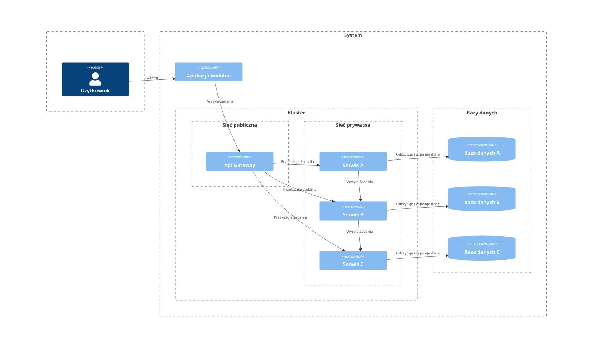

### System C4 Diagram v2
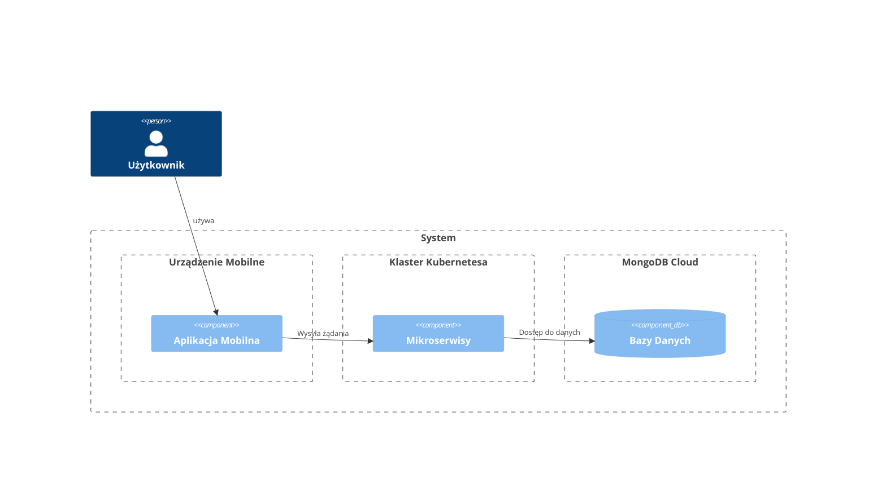

## Authenticator
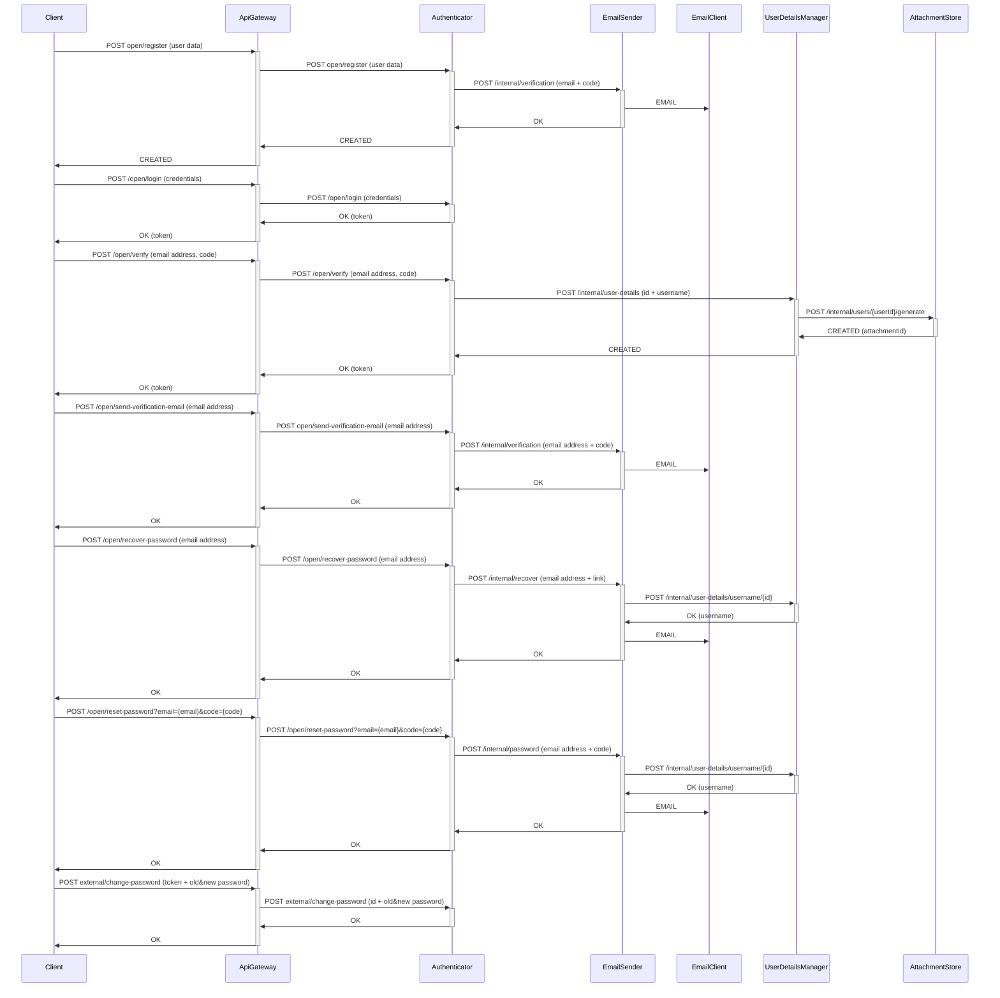
## User Details Manager

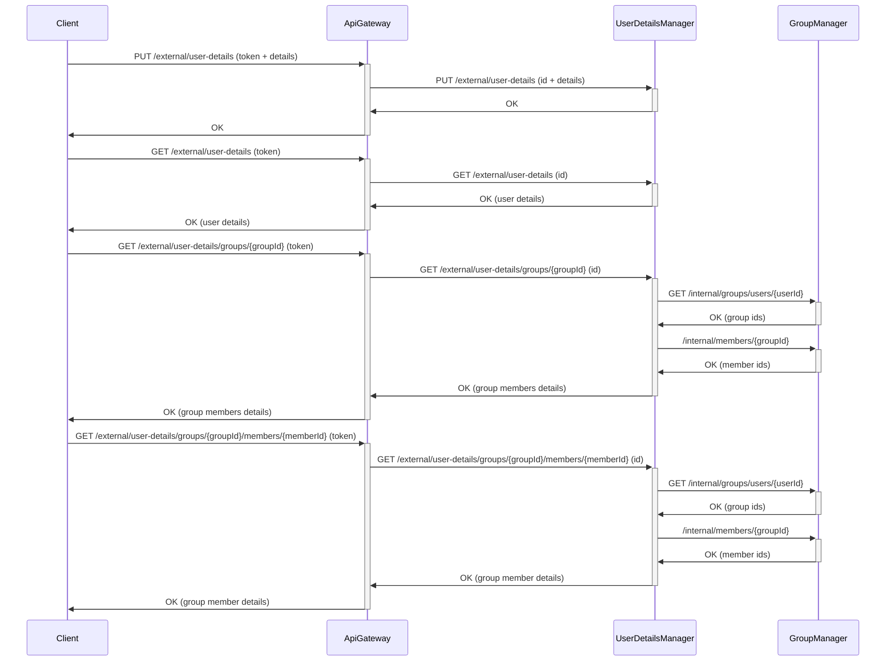

## Group Manager

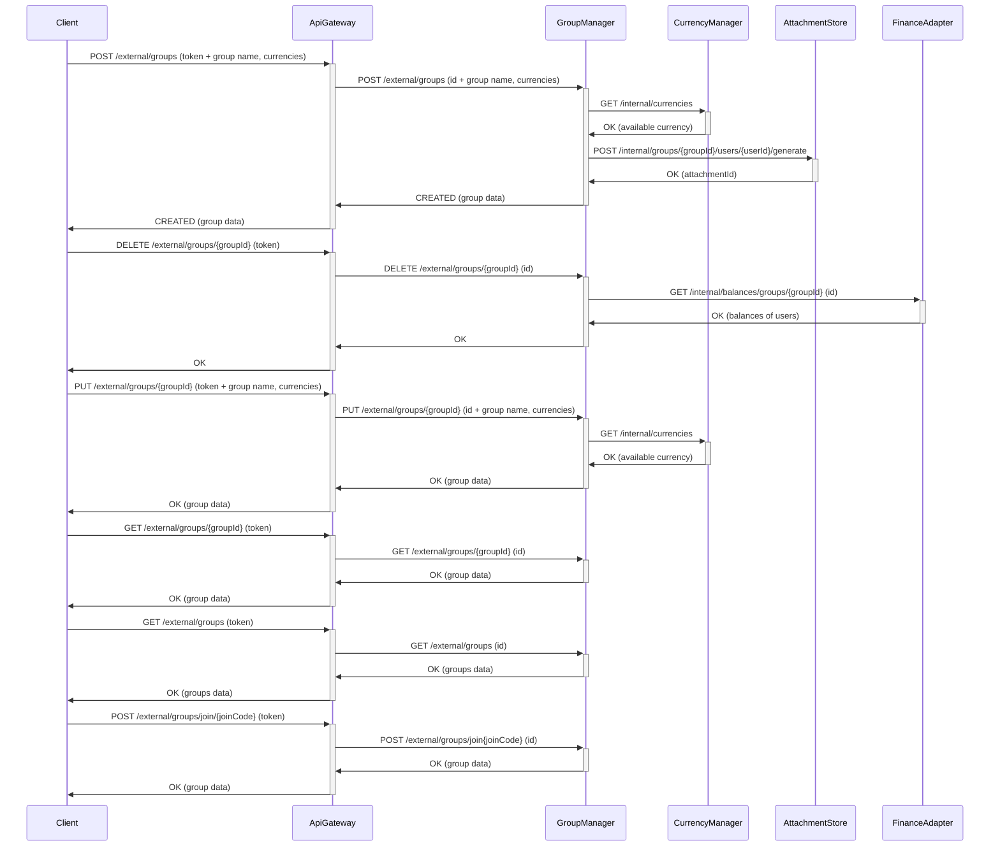

## Expense Manager

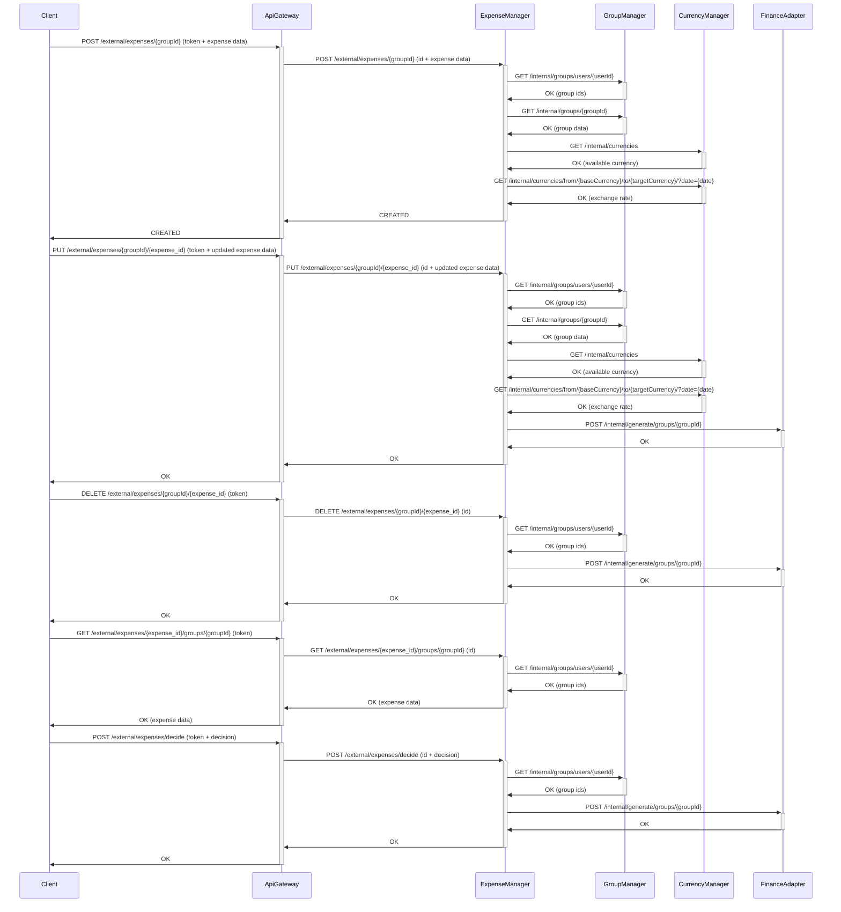

## Payment Manager

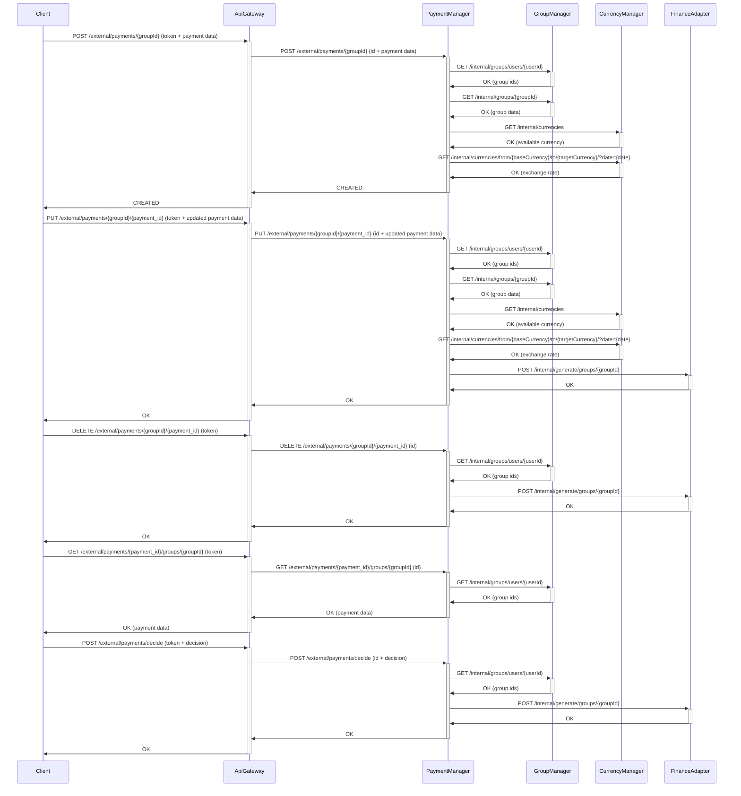

## Currency Manager

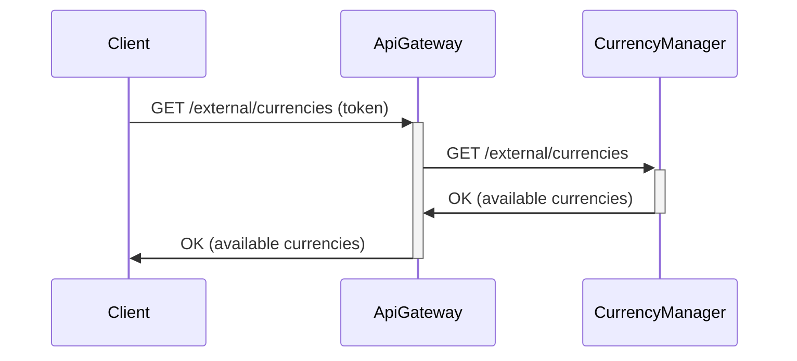

## Finance Adapter

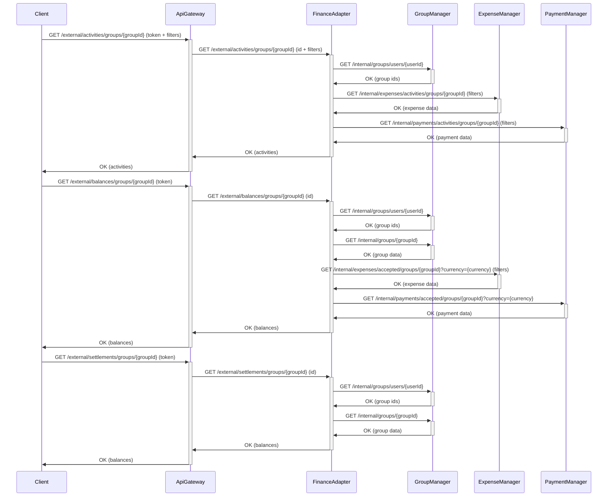

## Report Creator

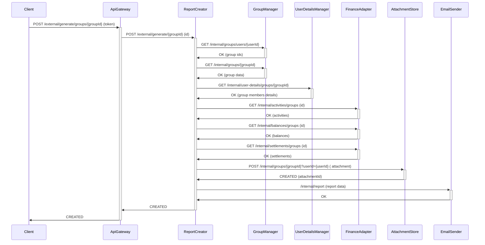

## Attachment Store

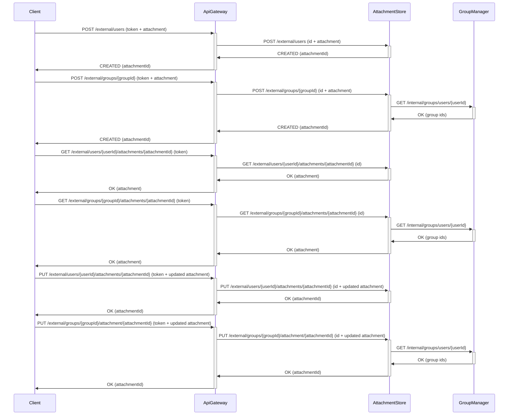